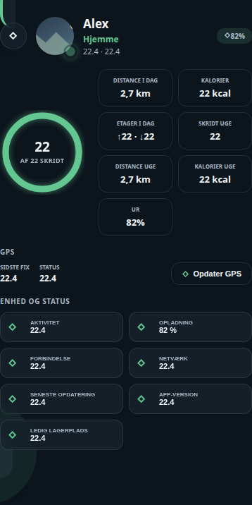

# Kid Tracker Card

## Neutral mobile preview



> Rendered at 390 px mobile width with fictional Home Assistant entities and values. No private dashboard, person, address, camera, or sensor data is included.


Et selvstændigt, tema-kompatibelt Lovelace-kort til Home Assistant. Kortet er flyttet fra en aktiv installation til et separat repository, så kildekode og versionshistorik kan vedligeholdes sikkert.

## Installation

Kopiér `ha-kid-tracker-card.js` til `/config/www/ha-kid-tracker-card/` og registrér ressourcen som et JavaScript-modul:

```text
/local/ha-kid-tracker-card/ha-kid-tracker-card.js?v=0.4.0
```

Tilføj derefter korttypen `custom:ha-kid-tracker-card` i Lovelace. De nødvendige entities angives i kortets konfiguration; repositoryet indeholder ingen installationens dashboardkonfiguration eller personlige data.

Kortet kan bruges til både telefoner og smartwatches. Ud over person, tracker,
lokation, afstand, hjemtur, batteri, aktivitet og GPS kan det vise enhedsstatus
med felterne `activity`, `battery_state`, `connection`, `ssid`, `last_update`,
`app_version` og `storage`. Yderligere installation-specifikke felter kan tilføjes
med `details`, for eksempel:

```yaml
details:
  - entity: sensor.example_temperature
    label: Temperatur
    icon: mdi:thermometer
```

Alle farver bruger først dashboardets egne tema-variabler, derefter Home
Assistants standardvariabler og til sidst almindelige farvekoder. Kortet er
derfor læsbart uden det oprindelige specialtema.

## Udvikling

```bash
npm run check
```

## Licens

MIT
